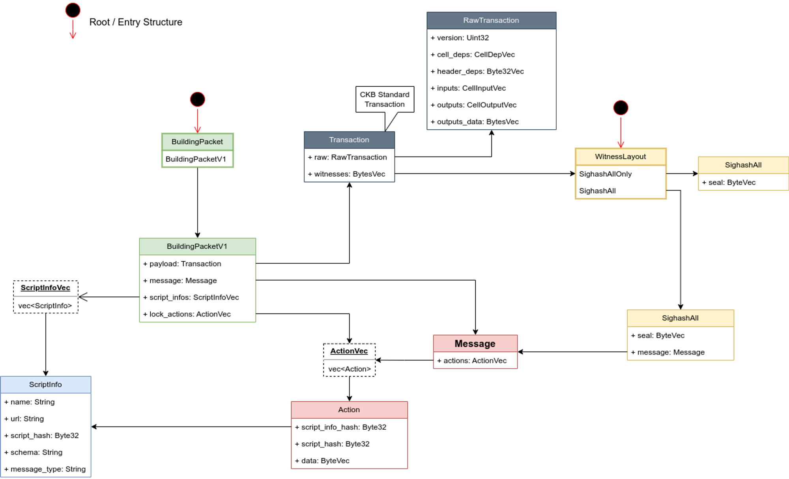

This document describes the migration process from an existing lock script to
one that supports CKB transaction co-build protocol. The migration process
involves three parts: the lock script (smart contract), DApp, and wallet.

## Lock Script Changes
The changes to the lock script are relatively simple. A TL;DR version is to only add one
line of code to existing project(See
[example](../contracts/transaction-cobuild-lock-demo/src/entry.rs)):
```Rust
if let Ok((message_digest, seal)) = parse_message() {
    // new code here
} else {
    // In this routine, it indicates that the WitnessLayout is not being
    // used. It is possible that the traditional WitnessArgs is being used.
    // The previous code can be copied and pasted here.
}
```
After making this change, the parsed values will be used in the signature
validation process.

In the previous implementation of the lock script, the message_digest and seal
values were calculated or parsed from the transaction hash and witness. You can
refer to the [system
script](https://github.com/nervosnetwork/ckb-system-scripts/blob/master/c/secp256k1_blake160_sighash_all.c)
for more details on how these values were derived.

With the added support for messages, the message digest(same as
[message](https://github.com/nervosnetwork/ckb-system-scripts/blob/a7b7c75662ed950c9bd024e15f83ce702a54996e/c/secp256k1_blake160_sighash_all.c#L151)
in secp256k1_blake160_sighash_all.c) is calculated using the following
components:
- skeleton hash
- message

The [skeleton hash](../ckb-transaction-cobuild/src/lib.rs) is calculated using the following components:
- transaction hash
- witnesses with index beyond input cell length

The final message digest can make the following parts not malleable:
- transaction
- witnesses used by all type scripts
- witnesses with index beyond input cell length

The `seal` value is actually the same as before, it is located in
[SighashAll](../schemas/basic.mol).

There is only one `SighashAll` variant in witness in whole transaction. If there
are some other lock scripts, they should use `SighashAllOnly`
variant or `WitnessArgs`. As designed, the `SighashAllOnly` variant doesn't include message part.

## Dapp Changes

Firstly, we need to define some actions for the Dapp. For example, if the Dapp
is an NFT application, it should include several action types: Mint, Transfer,
or Melt. We can pass some parameters in these actions to indicate "who created
this NFT," "to whom this NFT should be transferred," etc. An example definition
file can be found
[here](../schemas/spore.mol).
The definition file should be public, accessible to anyone.

When a user attempts a certain action, such as transferring an NFT to another
person, the Dapp should send the constructed `BuildingPacket` to the wallet. The
construction of the BuildingPacket is relatively complex and can be referenced in
the diagram below:


The detailed steps can be found by reading [the code](../dapp/src/tmTransferSpore.ts).

Note that the Message field in the BuildingPacket plays important role. This
message may vary depending on the DApp. It is constructed by the DApp and
displayed on the wallet. From the perspective of the lock script, the message is
treated as a black box.

The DApp will receive a signature if the wallet users approve and sign it. After
that, the DApp can fill the signature in the seal field in SighashAll and
broadcast the transaction to the CKB p2p network.

## Wallet Changes

When the wallet receives the BuildingPacket, it should perform [the following
steps](../dapp/src/tmWallet.ts):

- Verify if the `script_info_hash` in each Action in message corresponds to the
  `ScriptInfo`.
- Display the message and its related `ScriptInfo` on the screen and wait for
  the user to confirm.
- When the user clicks the confirm button, calculate the message digest based on
  the skeleton hash and message and sign it.
- Send the signature back to DApp.

## Others

The changes to the type script are not covered in this document. Essentially,
the type script should parse the message and verify that the information
contained within it is true, according to the transaction.
